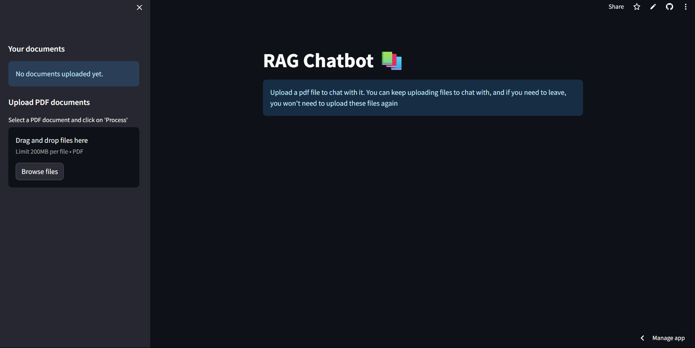

# RAG - ChatBot 🤖

A Retrieval-Augmented Generation (RAG) chatbot built using **Streamlit**, **ChromaDB**, and **local models** (no API limits!). Users can upload PDFs and query them with context-aware responses powered by semantic vector search and open-source language models.



# LINK

[https://ragchatbot-main-prs.streamlit.app/](https://ragchatbot-main-prs.streamlit.app/)

# Features 🚀

- **Semantic Search** with ChromaDB
- **PDF Parsing** with OCR fallback for scanned documents
- **LLM Integration** using Hugging Face Transformers (local chat model)
- **Embeddings** via SentenceTransformers (local, fast, no API key)
- **Interactive UI** built with Streamlit
- **Context-Aware QA** from custom documents

# Tech Stack 🛠️

| Tool        | Purpose                        |
|-------------|--------------------------------|
| [Streamlit](https://streamlit.io/) | UI and interaction frontend |
| [ChromaDB](https://www.trychroma.com/) | Vector storage and retrieval |
| [sentence-transformers](https://www.sbert.net/) | Local embeddings |
| [transformers](https://huggingface.co/docs/transformers/index) | Local chat LLM |
| [Tesseract OCR](https://github.com/tesseract-ocr/tesseract) | OCR fallback for non-extractable PDFs |
| [pdf2image](https://pypi.org/project/pdf2image/) | PDF page rendering for OCR |
| [PyMuPDF / fitz](https://pymupdf.readthedocs.io/) | Text extraction from PDFs |


# No API Limits!

- All core AI features run locally—no API keys, quotas, or billing required.
- Works offline (except for initial model downloads).

# How to Run

1. Install dependencies:
   ```bash
   pip install -r requirements.txt
   ```
2. Start the app:
   ```bash
   streamlit run app/app.py
   ```
3. Upload PDFs and start chatting!

# Notes

- Large chat models may require significant RAM/CPU/GPU. For best performance, use a machine with a good CPU or GPU, or switch to a smaller model if needed.
- OCR features require Tesseract and Poppler system packages (see `packages.txt`).

# Example Models

- Embeddings: `sentence-transformers/all-MiniLM-L6-v2`
- Chat: `mistralai/Mistral-7B-Instruct-v0.2` (can be swapped for smaller/faster models)

# Customization

- To use a different chat or embedding model, edit `app/utils/chatbot.py` and `app/utils/prepare_vectordb.py`.

# Troubleshooting

- If the app is slow or crashes, try a smaller chat model or check your system resources.
- For OCR issues, ensure system dependencies in `packages.txt` are installed.


